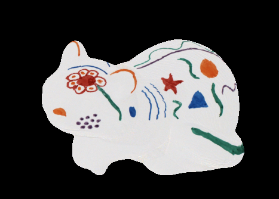

# Photometric Ambient Occlusion
Python implementation of D. Hauagge, S.Wehrwein, K. Bala, and N. Snavely. Photometric ambient occlusion. In *Proc. Computer Vision and Pattern Recognition (CVPR)*, pages 2515-2522,2013.

## notice
- this is *unoffical* implementation
- still work in progress as optimization is not quite working for second estimation

## requirement
Implemented with libraries of version in ```requirement.txt```

```bash
pip install -r requirement.txt
```

## usage
```bash
python demo.py --dir [DIR_PATH]
```

repalce ```DIR_PATH``` with yours.

For example, you can reproduce example similar to figure 1 in the paper bt passing ```data``` in this repository:

```bash
python demo.py --dir data
```

<p align="center">
 
</p>

if you have a directory(folder) containing image sequence:

In addition, below is the part of given sequences from [MIT Intrinsic Images dataset](https://www.cs.toronto.edu/~rgrosse/intrinsic/):

<p align="center">
    
    
    
    
</p>

At the below, left is the ground truth and right is derived by algorithm initially:

<p align="center">
    
    
</p>

And, here is the initial illumination calculated using derived reflectance:

<p align="center">
    
    
    
    
</p>

Here is after optimization:

<p align="center">
    
    
    
    
    
</p>

However, as you can see from above images something is not working right during optimization.

As I investigate on this matter, your participation is much appreciated as well.

if you have folder structure like:

folder0
- folder1
    - img0
    - img1
    - ...
- folder2
    - img0
    - img1
    - ...
- ...

you can use ```save.py``` as below:

```bash
python save.py --input-dir [INPUT_DIR_PATH] --output-dir [OUTPUT_DIR_PATH]
```

## reference
- [D. Hauagge, S.Wehrwein, K. Bala, and N. Snavely. Photometric ambient occlusion. In *Proc. Computer Vision and Pattern Recognition (CVPR), pages 2515-2522,2013.](https://www.cs.cornell.edu/projects/photoao/files/photoao_cvpr2013_v2.pdf)
- [original matlab code for demo by authors](https://www.cs.cornell.edu/projects/photoao/files/photoao_cvpr2013_code.zip) (*download will start if you click*)
- [Roger Grosse, Micah K. Johnson, Edward H. Adelson, and William T. Freeman, Ground truth dataset and baseline evaluations for intrinsic image algorithms, in Proceedings of the International Conference on Computer Vision (ICCV), 2009](https://www.cs.toronto.edu/~rgrosse/iccv09-intrinsic.pdf)